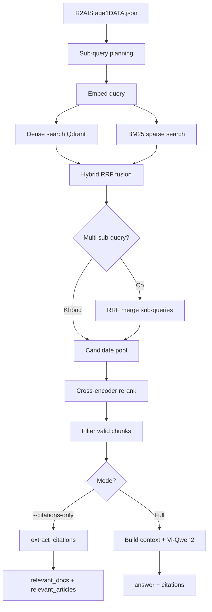

# Tổng quan Pipeline R2AI Stage 1

**Ngày cập nhật:** 29/06/2026  
**Script chính:** `scripts/rag_answer_stage1.py`

---

## 1. Mục tiêu

Pipeline RAG (Retrieval-Augmented Generation) trả lời câu hỏi pháp luật Việt Nam cho benchmark **R2AI Stage 1**:

1. Nhận câu hỏi từ dataset test
2. Retrieve đoạn văn bản pháp luật từ **Qdrant**
3. Rerank bằng cross-encoder
4. Trích xuất trích dẫn (`relevant_docs`, `relevant_articles`) và/hoặc sinh câu trả lời bằng LLM

---

## 2. Kiến trúc tổng thể



---

## 3. Hạ tầng & Models (29/06)

| Thành phần | Giá trị hiện tại |
|------------|------------------|
| Vector DB | Qdrant Cloud — collection `vld_business_law_v2` |
| Dense vector | `dense` (1024-dim) |
| Sparse vector | `bm25` (BM25 trên Qdrant) |
| Embedding | `models/Vietnamese_Embedding_v2` |
| Reranker | `models/Vietnamese_Reranker` |
| LLM (khi generate) | `models/Vi-Qwen2-1.5B-RAG` |

Cấu hình qua file `.env` (xem `.env.example`).

---

## 4. Các chế độ chạy

| Chế độ | Flag CLI | Output |
|--------|----------|--------|
| **Citations only** | `--citations-only` | Chỉ `relevant_docs` + `relevant_articles`, không LLM |
| **Full pipeline** | (mặc định) | `answer` + citations |
| **Retrieve only** | `--retrieve-only` | Cache chunks → `R2AIStage1_retrieved.json` |
| **Generate from cache** | `--skip-retrieve` | Đọc cache, chạy LLM |
| **Citations from cache** | `--citations-only --skip-retrieve` | Trích dẫn từ cache đã retrieve |

### Lệnh ví dụ

```bash
# Citations only — thử llm_top_k=3
python scripts/rag_answer_stage1.py \
  --citations-only \
  --llm-top-k 3 \
  --output test/R2AIStage1_citations_llm_top3.json

# Full pipeline (retrieve + generate)
python scripts/rag_answer_stage1.py \
  --output test/R2AIStage1_answers.json

# Resume — bỏ qua câu đã có trong output
python scripts/rag_answer_stage1.py \
  --citations-only \
  --skip-answered \
  --output test/R2AIStage1_citations.json
```

---

## 5. Luồng xử lý chi tiết

### 5.1. Đầu vào

- **Dataset:** `test/R2AIStage1DATA.json`
- Mỗi item: `id`, `question`
- Có thể giới hạn bằng `--start-id`, `--limit`

### 5.2. Sub-query decomposition

Câu hỏi dài/phức tạp được tách thành nhiều truy vấn con để retrieve tốt hơn.

**Thứ tự ưu tiên** (`RetrievalEngine._retrieval_queries`):

1. Cache có sẵn — `test/R2AIStage1_subqueries (1).json` (`--subquery-cache`)
2. Rule-based runtime — `scripts/query_decompose.py`
3. Subquery index — `scripts/subquery_loader.py`
4. Fallback — giữ nguyên câu hỏi gốc

**Rule-based patterns** (ví dụ):

- `"... như thế nào và ... ra sao?"`
- Hai khía cạnh pháp lý nối bằng `" và "` (điều kiện, thủ tục, mức phạt, …)
- Mệnh đề phụ sau dấu phẩy (`"Nếu ... thì ..."`)

**Token budget** (khi bật `--use-llm-subquery`):

| Số token | Số sub-query |
|----------|--------------|
| < 30 | 1 |
| 30 – 58 | 2 |
| ≥ 58 | 3 |

Tắt sub-query: `--no-subquery`

### 5.3. Hybrid retrieval (Dense + BM25)

Với **mỗi** query (gốc hoặc sub-query):

#### a) Dense (semantic search)

- Encode query bằng `SentenceTransformer`
- ANN search trên Qdrant → top `--retrieve-pool` (mặc định **30**)

#### b) BM25 (sparse search)

- **Qdrant Cloud:** sparse vector `bm25` (`QDRANT_SPARSE_VECTOR_NAME`)
- **Local:** build index từ corpus, cache tại `output/bm25_corpus.pkl`

#### c) Weighted RRF fusion

Gộp dense + BM25 bằng Reciprocal Rank Fusion (`scripts/bm25_retrieval.py`):

| Tham số | Giá trị |
|---------|---------|
| Trọng số dense | 0.4 |
| Trọng số BM25 | 0.6 |
| RRF constant `k` | 60 (`--rrf-k`) |
| Pool sau RRF | 50 (`--rrf-top-k`) |

Tắt hybrid: `--no-bm25`

#### d) Multi-query RRF

Nếu có nhiều sub-query → mỗi query cho một danh sách chunk → RRF merge thành một pool chung (tối đa 50).

### 5.4. Cross-encoder rerank

Module: `scripts/rerank_retrieval.py`

**Hybrid rerank** (mặc định bật):

```
final_score = primary_weight × score(câu_hỏi_gốc, chunk)
            + sub_weight   × mean(score(sub_query_i, chunk))
```

| Tham số | Mặc định |
|---------|----------|
| `--primary-weight` | 0.7 |
| `--sub-weight` | 0.3 |
| `--top-k` | 8 (chunk sau rerank) |

Tắt rerank: `--no-rerank`

### 5.5. Lọc chunk hợp lệ

`filter_valid_chunks` loại chunk thiếu metadata pháp lý:

| Lý do | Điều kiện |
|-------|-----------|
| `no_code` | Không có mã văn bản (vd. `04/2017/QH14`) |
| `no_title` | Không có tiêu đề luật |
| `bad_title` | Tiêu đề rỗng, bắt đầu bằng "Căn cứ", "Theo " |

Mã văn bản và tiêu đề được resolve từ payload Qdrant hoặc parse từ nội dung chunk.

### 5.6. Trích xuất citations (`--citations-only`)

Lấy top `--llm-top-k` chunk sau retrieve + rerank → `extract_citations`.

#### `relevant_docs`

Format: `{mã_văn_bản}|{tiêu_đề}`

```
04/2017/QH14|Luật Hỗ trợ doanh nghiệp nhỏ và vừa 2017
```

- Gom theo identity văn bản (chuẩn hóa VBHN ↔ bản gốc)
- Ưu tiên VBHN khi điểm rerank bằng nhau

#### `relevant_articles`

Format: `{mã}|{tiêu_đề}|{Điều/Phụ lục}`

```
04/2017/QH14|Luật Hỗ trợ doanh nghiệp nhỏ và vừa 2017|Điều 12
```

- Số điều từ `article_no`, `node_label`, hoặc regex `Điều \d+`
- Mỗi cặp `(identity_văn_bản, điều)` chỉ xuất hiện một lần

#### Output mẫu

```json
{
  "id": 1,
  "question": "...",
  "answer": "",
  "relevant_docs": [
    "04/2017/QH14|Luật Hỗ trợ doanh nghiệp nhỏ và vừa 2017"
  ],
  "relevant_articles": [
    "04/2017/QH14|Luật Hỗ trợ doanh nghiệp nhỏ và vừa 2017|Điều 12"
  ]
}
```

### 5.7. Sinh câu trả lời (full pipeline)

1. Offload embed/rerank khỏi GPU
2. Load **Vi-Qwen2-1.5B-RAG** (4-bit quantization mặc định trên CUDA)
3. Build context từ top `--llm-top-k` chunk:

```
[mã|tiêu_đề|Điều X]
<nội dung chunk>
---
...
```

4. Prompt RAG (tiếng Việt, một đoạn văn liền mạch, không bullet)
5. Generate: `temperature=0.1`, `max_new_tokens=512`
6. Output: `answer` + `relevant_docs` + `relevant_articles`

Pipeline **interleaved**: xử lý theo batch (`--retrieve-batch=4`) — retrieve xong mới generate, tiết kiệm RAM GPU.

---

## 6. Tham số quan trọng

| Tham số | Mặc định | Ý nghĩa |
|---------|----------|---------|
| `--top-k` | 8 | Chunk sau rerank |
| `--llm-top-k` | 2 | Chunk dùng cho context LLM / citations |
| `--retrieve-pool` | 30 | Pool mỗi phương thức (dense/BM25) trước RRF |
| `--rrf-top-k` | 50 | Pool sau RRF, trước rerank |
| `--rrf-k` | 60 | Hằng số RRF |
| `--retrieve-batch` | 4 | Số câu hỏi mỗi vòng retrieve |
| `--gen-batch` | 2 | Batch size LLM generation |
| `--max-context-chars` | 3500 | Giới hạn ký tự context cho LLM |
| `--max-new-tokens` | 512 | Giới hạn token sinh ra |
| `--rerank-batch` | 8 | Batch size reranker |

### Ảnh hưởng của `--llm-top-k`

Số chunk đầu vào cho `extract_citations`. Thử nghiệm 29/06:

| File output | `llm_top_k` |
|-------------|-------------|
| `R2AIStage1_citations_llm_top1.json` | 1 |
| `R2AIStage1_citations_llm_top2.json` | 2 |
| `R2AIStage1_citations_llm_top3.json` | 3 |
| `R2AIStage1_citations_llm_top5.json` | 5 |
| `R2AIStage1_citations_llm_top6.json` | 6 |
| `R2AIStage1_citations.json` | (baseline) |

`llm_top_k` cao hơn → thường nhiều `relevant_docs` / `relevant_articles` hơn, nhưng có thể thêm nhiễu.

---

## 7. Cache & resume

| File | Mục đích |
|------|----------|
| `test/R2AIStage1_retrieved.json` | Cache chunks + sub_queries theo từng `id` |
| `output/bm25_corpus.pkl` | Cache BM25 index (local mode) |
| `test/R2AIStage1_subqueries (1).json` | Sub-query precomputed |

| Flag | Hành vi |
|------|---------|
| `--skip-answered` | Bỏ qua câu đã có trong output |
| `--start-id` | Bắt đầu từ `id` cụ thể |
| `--limit` | Giới hạn số câu |
| `--skip-retrieve` | Dùng cache retrieve thay vì query lại Qdrant |

---

## 8. Cấu trúc module

```
.                              # Thư mục gốc repo
├── README.md
├── docs/                        # Tài liệu chi tiết
└── R2AI/
    ├── scripts/
    │   ├── rag_answer_stage1.py     # Orchestrator chính
    │   ├── qdrant_config.py         # Kết nối Qdrant, query dense/sparse
    │   ├── bm25_retrieval.py        # BM25 + weighted RRF
    │   ├── rerank_retrieval.py      # Cross-encoder rerank
    │   ├── query_decompose.py       # Tách sub-query rule-based
    │   ├── subquery_loader.py       # Load cache sub-query
    │   ├── query_qdrant.py          # Test retrieval đơn lẻ
    │   ├── rerank_hybrid.py         # Tiện ích rerank hybrid
    │   ├── ingest_parquet_to_qdrant.py
    │   ├── ingest_docx_to_qdrant.py
    │   └── check_expired_law_codes.py
    │
    ├── test/
    │   ├── R2AIStage1DATA.json              # Input câu hỏi
    │   ├── R2AIStage1_retrieved.json        # Cache retrieve
    │   ├── R2AIStage1_citations*.json       # Output citations
    │   └── R2AIStage1_answers.json        # Output full pipeline
    │
    ├── models/
    │   ├── Vietnamese_Embedding_v2/
    │   ├── Vietnamese_Reranker/
    │   └── Vi-Qwen2-1.5B-RAG/
    │
    ├── Extractor_chunk/             # Chunking văn bản (ingest)
    ├── Reader/                      # Đọc DOCX/PDF (ingest)
    └── Construct_Tree/              # Xây cây pháp luật (ingest)
```

---

## 9. Tóm tắt luồng citations (đang chạy 29/06)

```
Câu hỏi (R2AIStage1DATA.json)
  │
  ├─► Sub-query planning (cache / rule-based)
  │
  ├─► Với mỗi query:
  │     Dense (top 30) + BM25 (top 30)
  │     → Weighted RRF (dense 0.4, BM25 0.6, k=60)
  │
  ├─► Multi-query RRF merge (nếu có sub-query) → pool 50
  │
  ├─► Cross-encoder rerank (hybrid 0.7/0.3) → top 8
  │
  ├─► Filter valid chunks (mã VB, tiêu đề)
  │
  ├─► Lấy top llm_top_k chunk
  │
  └─► extract_citations → relevant_docs + relevant_articles
        → Ghi JSON (không LLM)
```

---

## 10. Ghi chú GPU / OOM

- Embed + rerank chạy trên GPU (`--device-embed cuda`, `--device-rerank cuda`)
- Full pipeline: offload embed/rerank trước khi load LLM
- LLM mặc định 4-bit quantization (`--no-4bit` để tắt)
- `AdaptiveGenBatch`: tự giảm `gen_batch` khi OOM (8 → 4 → 2 → 1)
- Single-answer fallback: giảm `llm_top_k` và `max_context_chars` khi OOM
